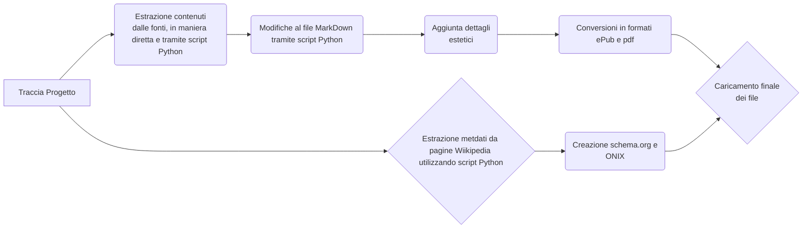

---

title: Relazione del progetto d'esame di Editoria Digitale

author: Simone Piccirillo 12034A

date: a.a. 2024/2025

institute: Università degli Studi di Milano

course: Editoria Digitale

tags: tag1, tag2, tag3

version: 0.1

kind: Document

bibliography: bibliografia.bib

csl: IEEE.csl

---

  

  

# Evoluzione Dello Sport Nel 900

Progetto per il corso di Editoria Digitale (Prof.Paolo Ceravolo)

  
  

## Introduzione

  

Il progetto ha come obiettivo quello di mostrare le varie fasi storiche dello sport durante il 900.
Le fonti da cui sono state prese le informazioni sono Europeana e Wikipedia da cui sono stati presi articoli e foto inseriti nel documento finale.
Sono stati usati codici Python per l'estrazione di informazioni dalle pagine Wikipedia, per la conversione nei vari formati, per la modifica di file markdown e per la creazione degli schemi Onix e schema.org.
La parte estetica del documento html è stata gestita con css e javascript.
Il documento finale presenta diverse sezioni navigabili tramite un indice, ogni sezione è divisa in Inizio, Metà e Fine 900 per mostrare le differenze tra i vari periodi.
Il prodotto è disponibile nei formati: html, epub, pdf.

  

## Ideazione

  

### Tema

Il tema principale è l'evoluzione dello sport nel 900, il documento mostra testimonianze e storie dei protagonisti sportivi di quegli anni dando la possibilità di muoversi tra i vari periodi per sottolineare le differenze storiche

### Destinatari

I destinatari possono essere degli studenti in cerca di materiale per dei progetti, docenti o appassionati di sport.
Ecco alcuni esempi di personas:

**Personas 1**:  Mattia Alessi, 20 anni, vive a Milano.
Studente di Storia all'Università Statale Di Milano.
Passa le sue giornate tra università e il campo da basket, sua grande passione.

**Valori**:
Vuole una vita dinamica e divisa tra sport e studio, cerca di essere il più presente possibile nelle attività che svolge e ama dare un'occhio al passato per imparare dalla storia.

**Bisogni**:
Ha bisogno di compagnia per tutte le sue attività e ogni tanto di prendersi una pausa per ricaricare le energie

**Desideri**:
Vorrebbe avere sempre compagni da sfidare in una partita e condividere momenti di studio all'università

**Scenario D'Uso**:
Per un esame universitario Mattia deve consegnare una relazione riguardo un momento sportivo che ha lasciato un segno nella storia del 900, cercando di essere il più preciso possibile con date, riferimenti e luoghi.
Tra le varie ricerche sul web mette insieme del materiale e tramite il nostro prodotto può scegliere con cura che momento del 900 prendere in considerazione.

**Personas 2**: Carlo Rossi, 86 anni, vive a Milano.
Ex atleta italiano.
Passa le sue giornate con la famiglia e ogni tanto va nelle vecchie palestre e campi di atletica che frequentava per rivivere il passato.

**Valori**:
Attualemente dedito alla famiglia e grande stimatore di chi inserisce lo sport nella sua vita quotidiana

**Bisogni**:
Ha bisogno di essere presente per la famiglia in quanto in passato a causa dei suoi impegni sportivi era sempre lontano, ogni tanto ritorna nei posti dove si allenava per ricordare le imprese sportive

**Desideri**:
Vivere una vita tranquilla e vedere qualche suo nipote indossare la maglia della nazionale italiana in qualsiasi sport

**Scenario D'uso**:
Per ricordare le sue imprese sportive, o semplicemente per rivivere quei momenti, Carlo si circonda di libri e articoli riguardo gli anni in cui lui era in pista, dal 1964 al 1976.
Acquista in maniera continuativa prodotti riguardo la storia dello sport.

  
  

### Modello di fruizione

Il prodotto presenterà un modello di Lettura Non Lineare in quanti chi ne usufruisce potrà saltare tra le varie sezione tramite l'indice, non è importante dover passare tra le varie sezioni per arrivare a quella voluta in quanto vengono trattati diversi periodi e diversi argomenti quindi si potrà arrivare direttamente all'arogmento voluto

  

### Canali di distribuzione

I canali di distribuzione possono essere principalmente il Web e Market Place dove chi vuole può leggere da una pagina web o acquistare un ePub.
I formati saranno hmtl per le pagine web, ePub e pdf per la vendita diretta del prodotto.
L'identità visuale del prodotto sarà semplice in quanto i contenuti saranno presentati tramite testi o immagini per mantenere l'aspetto storico degli argomenti, il tutto può essere arricchito con brevi video di mmomenti iconici della storia dello sport.
Lo stile sarà formale per avere una descrizione degli argomenti il più chiara possibile.

## Processo di Produzione

### Acquisizione dei contenuti

L'acquisiozione dei contenuti per la creazione del prodotto editoriale è stata fatta da pagine web che mettono a disposizione fonti libere.
Le pagine web utilizzate sono Wikipedia e Europeana.

### Gestione documentale

Descrivere il *flusso di gestione documentale* definito per il progetto. Ad esempio, (i) la raccolta o produzione dei contenuti, (ii) la valutazione dei diritti, (iii) la trasformazione dei formati, (iv) la strutturazione dei contenuti, (v) l'applicazione dello stile grafico, (vi) la generazione dei metadati, (vii) la distribuzione dei contenuti. Nella descrizione del flusso considerare le fasi di revisione, controllo e approvazione che possono richiedere le diverse fasi.

Il flusso di gestione documentale è diviso in varie fasi:
- Sono stati acquisiti i vari contenuti dalle fonti citate prima, tutti con licenze libere
- è stato creato il file html in cui sono stati inseriti i contenuti, alcuni contenuti sono stati presi da pagine wikipedia utilizzando lo script Python "take_sorgente.py", il file MarkDown dato in output è stato opportunamente modificato tramite lo script "modify_md.py", dalla stessa pagina sono stati presi metadati utilizzando lo script "get_metadata_from_Wikipedia.py", i contenuti ottenuti sono stati poi inseriti nel file html.
- Creazione del file metadati.yaml che è stato usato per la creazione degli schemi Onix e schema.org utilizzando lo script "CreaSchemi_da_yaml.py"
- Il file html è stato convertito in MarkDown utilizzando Pandoc e tramite lo script "Converti.py" sono stati creati i formati ePub e pdf
- I file sono stati modificati per avere un risultato estetico migliore.

  

  

### Tecnologie adottate

Le tecnlogie utilizzate sono:
- html per la pagina visibile sul web
- MarkDown utilizzato come tramite per la conversione dei file, per alcune modifiche estetica
- python utilizzato per le conversione, l'estrazione di contenuti e metadati
- Pandoc utilizzato tramite python per le conversioni dei formati
I formati disponibili per questo contenuto sono html per il web, ePub per gli eBook e pdf per un'eventuale stampa
  

| |Scenario 1 |Scenario 2 |

|----------------|-------------------------------|-----------------------------|

|Markdown |`'Isn't this fun?'` |'Isn't this fun?' |

|html |`"Isn't this fun?"` |"Isn't this fun?" |

|ePub |`-- is en-dash, --- is em-dash`|-- is en-dash, --- is em-dash|

|pdf |`-- is en-dash, --- is em-dash`|-- is en-dash, --- is em-dash|

  

### Esecuzione del flusso

Tutti i fle utilizzati per il progetto sono disponibili nella repository di Github

  

## Valutazione dei risultati raggiunti

  
  

### Valutazione del flusso di produzione

Grazie alle tecnologie usate si riducono di molto i tempi di gestione documentale in quanto le informazioni dalle sorgenti vengono prese in maniera diretta dagli script python, e lo stesso vale per i metadati, le varie conversioni poi vengono fatte tramite un solo script.
Anche gli errori si riducono notevolmente in quanto gli script usati sono pre-scritti e quindi già coontrollati.
Grazie a queste tecnologie i canali di distribuzione possibili aumentano in quanto la disponibilità di formati è molto ampia e la qualità dei documenti può sempre migliorare in base alle necessità degli utenti e dei canali di distribuzione.

### Confronto con lo stato dell'arte

Può anche essere utile confrontare una versione ASIS del flusso di gestione, senza la tecnologia o le innovazioni proposte, e una TOBE che include la tecnologia e le innovazioni proposte dallo studente.

  

### Limiti emersi

Sono apparsi alcuni limiti nel prendere contenuti dal sito Europeana, in quannto alcune pagine non davano la possibilità di poter prendere informazioni tramite lo script python, la soluzione è stata scaricare la pagina html, convertirla in MarkDown e lavorare su quella.
La conversione in ePub ha dato qualche problema estetico in quanto viene mantenuto un solo colore per tutto il testo.
La conversione in pdf non è andata a buon fine per problemi riguardo la tipologia di engine per la conversione in pdf. 

  

## Conclusioni

Il risultato finale mostra un documento visibile tramite pagina web (formato hmtl) o eBook (formato ePub), non si è raggiunto il punto per la conversione in pdf in quanto per problemi di installazione o per problemi di visibilità la conversione in pdf non è andata a buon fine.

  

## Bibliografia e sitografia

https://www.europeana.eu/en/themes/sport
https://en.wikipedia.org/wiki/Camille_du_Gast
