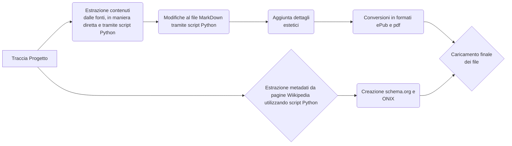

# Evoluzione dello Sport nel 900 (Editoria-Digitale)
Progetto per l'esame di Editoria Digitale (Prof. Paolo Ceravolo)

Il progetto è presentato in 3 formati:

## HTML
 - Apri la [pagina Web](https://SimPicc.github.io/Editoria-Digitale/Progetto/index.html)

## ePub
 - Scarica l'[eBook](https://github.com/SimPicc/Editoria-Digitale/raw/main/Progetto/Sport900.epub)

## pdf
 - Scarica il [pdf](https://github.com/SimPicc/Editoria-Digitale/raw/main/Progetto/Sport900.pdf)

## Struttura
Il progetto è stato realizzato utilizzando contenuti liberi presi da siti web com Wikipedia e Europeana.
Le tecnologie usate sono Python, html, css, javascript, Pandoc, MarkDown.
Il documento è presentato in formato html per le pagine web, in ePub per eventuali eBook, in pdf per la stampa.
Nella repository sono presenti tutti gli script usati, metadati e bibliografia.

## Flusso Di Gestione Documentale

